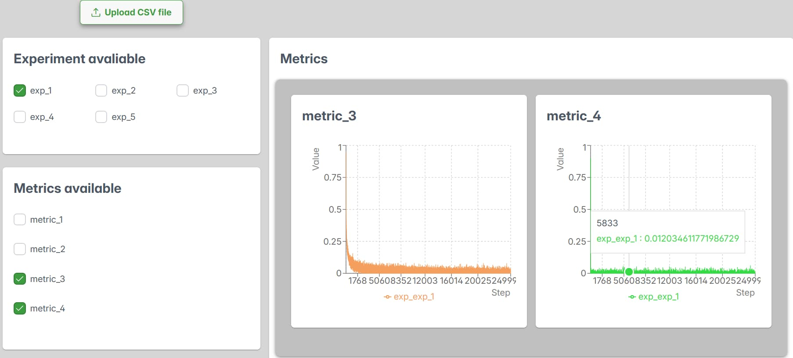
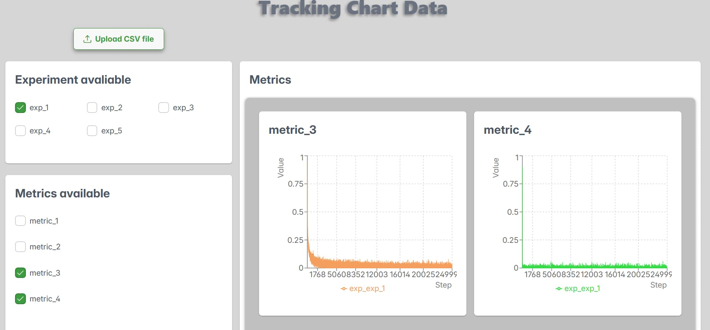
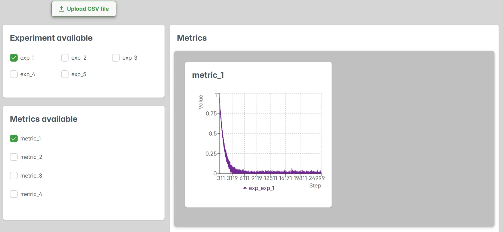
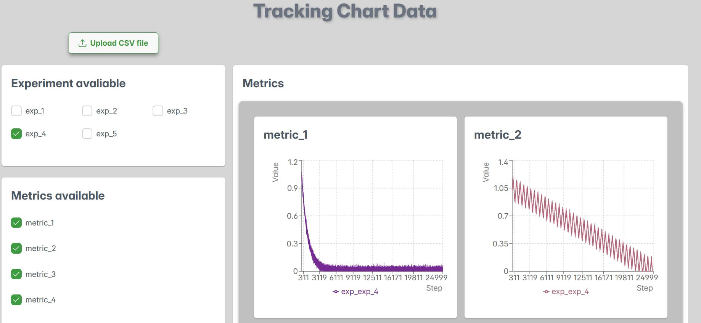
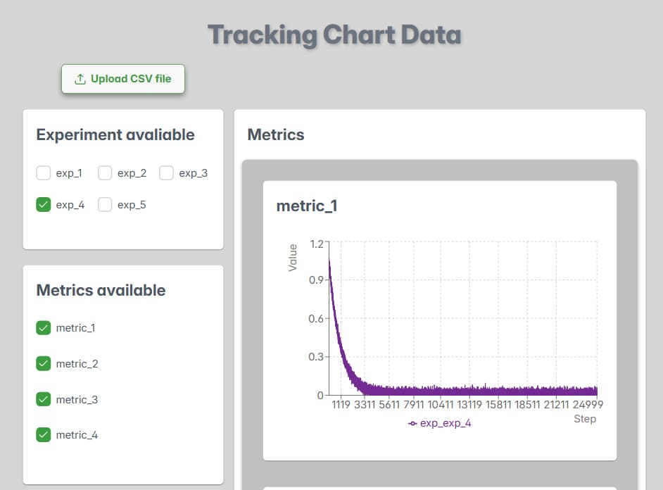
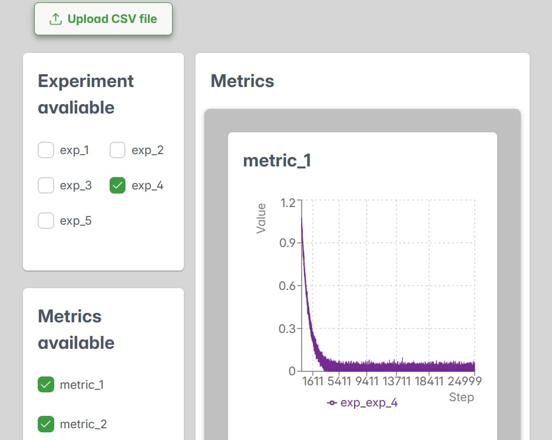

# React + Vite

# 📊 _`Chart & Data`_ — Data Visualization & Metrics Analysis

`Chart & Data` is a responsive single-page web application designed for visualizing data from CSV files and analyzing experiment metrics. Users can upload datasets, select experiments and metrics, and instantly view charts and numerical values — all within a clean and efficient interface.

🔗 **Live Demo**: [experiment-chart.netlify.app](https://experiment-chart.netlify.app)

## Key Features

- 📂 Upload CSV files for analysis
- 🧪 Select experiments from a dynamic list
- 📊 Choose one or multiple metrics simultaneously
- 📈 View interactive charts and metric values
- 📱 Responsive design for seamless use across devices

---

## Gallery Preview

<div style="display: flex; flex-wrap: wrap; gap: 15px;">
  
  
  
  
  
  
</div>

---

## Technologies Used

This project is built with a modern frontend stack focused on performance, flexibility, and maintainability:

- **React 19** — core UI framework
- **Redux Toolkit** — centralized state management
- **React Redux** — seamless Redux integration
- **Reselect** — memoized selectors for performance
- **Recharts** — chart rendering and data visualization
- **PapaParse** — CSV parsing utility
- **PrimeReact** — UI components
- **PrimeFlex** — utility-first styling

---

## Getting Started

To run the project locally:

```bash
# Clone the repository
git clone `repository name`

# Navigate to the project directory
cd `redux-chart`

# Install dependencies
npm install

# Start the development server
npm run dev
```
